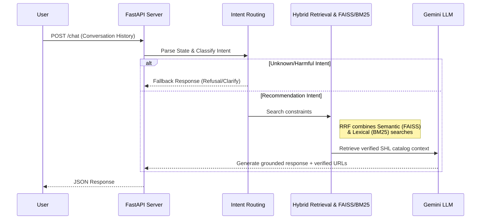

# 🚀 SHL Assessment Recommender Agent

*A stateless, highly resilient FastAPI microservice for discovering and comparing SHL assessments.*

[](https://www.python.org/downloads/release/python-3120/)
[](https://fastapi.tiangolo.com/)
[](https://huggingface.co/spaces)
[](https://ai.google.dev/)

---

> **Live Deployment:** [View on Hugging Face Spaces](#) *(https://rupesh002-shl-assessment-recommender.hf.space/docs)*

## 📖 Overview
This project is a conversational AI agent designed to help users navigate, discover, and compare various SHL assessments. Powered by a **Custom Hybrid Retrieval Engine (FAISS + BM25)** and **Google's Gemini LLM**, it acts as a smart, highly reliable microservice.

## ✨ Key Features

*   **🧠 Stateless Architecture:** Flattens conversation history into a dynamic JSON state on every request. This allows users to change constraints mid-conversation without complex memory management overhead.
*   **🔍 Hybrid Retrieval (RRF - Reciprocal Rank Fusion):** Seamlessly combines dense semantic search (`FAISS` + `sentence-transformers`) with sparse lexical search (`BM25`) to ensure hyper-accurate retrieval of both broad skill concepts and exact test names.
*   **🚦 Deterministic Intent Routing:** A custom controller classifies user intent (`CLARIFY`, `RECOMMEND`, `COMPARE`, `REFUSE`) *before* querying the LLM. This strictly prevents hallucinated URLs and blocks out-of-scope or unsafe requests.
*   **🛡️ Resilience Engineering:** Gracefully catches LLM API rate limits (HTTP 429) and falls back to clarification prompts instead of crashing the server.

## 🏗️ Architecture Flow

The system processes queries in a highly deterministic, pipeline-oriented manner:

1.  **State Extraction:** Flattens the incoming conversational history into constraints.
2.  **Intent Classification (Router):** 
    *   If intent is `CLARIFY` or `REFUSE`, the system bypasses retrieval and responds directly.
    *   If intent is `RECOMMEND` or `COMPARE`, it moves to the retrieval stage.
3.  **Hybrid Retrieval Engine:**
    *   **Dense Search:** Embeds query using Sentence Transformers and searches via `FAISS` for semantic matches.
    *   **Sparse Search:** Uses `BM25` for exact keyword matches.
    *   **Rank Fusion:** Merges semantic and exact-match results using Reciprocal Rank Fusion (RRF).
4.  **LLM Generation:** `Google Gemini LLM` injects the top retrieved verified internal data into a prompt and generates a strict JSON response containing the final reply and assessment URLs.



## 🛠️ Prerequisites

*   **Python 3.12**: Strictly required. Using 3.12 ensures that heavy machine learning dependencies (`sentence-transformers`, `torch`, and `faiss-cpu`) install cleanly without version conflicts.
*   **Google Gemini API Key**: Grab a free key from Google AI Studio.

## 💻 Local Setup & Installation

**1. Clone the repository**
```bash
git clone https://github.com/Rupeshbhardwaj002/SHL-assignment-Recommender.git
cd SHL-assignment-Recommender
```

**2. Create and activate a virtual environment**
```bash
# On Windows
python -m venv venv
venv\Scripts\activate

# On macOS/Linux
python3.12 -m venv venv
source venv/bin/activate
```

**3. Install dependencies**
```bash
pip install --no-cache-dir -r requirements.txt
```

**4. Environment Variables**
Create a `.env` file in the root directory and add your API credentials:
```env
GEMINI_API_KEY=your_actual_api_key_here
```

## 🏃‍♂️ Running the Application

Start the FastAPI server using Uvicorn:
```bash
uvicorn app.main:app --host 0.0.0.0 --port 8000 --reload
```
Once the server says `"Application startup complete"`, you can access:
*   **Swagger UI (Interactive Docs):** http://localhost:8000/docs
*   **Health Check:** http://localhost:8000/health

## 🔌 API Endpoints

### `GET /health`
Verifies that the API is awake and the retrieval engine is successfully loaded.

**Response:**
```json
{
  "status": "ok"
}
```

### `POST /chat`
The main conversational endpoint. It expects a strictly formatted conversation history.

**Request:**
```bash
curl -X 'POST' \
  'http://localhost:8000/chat' \
  -H 'accept: application/json' \
  -H 'Content-Type: application/json' \
  -d '{
  "messages": [
    {
      "role": "user",
      "content": "I am looking to hire a mid-level Java developer. What tests do you recommend?"
    }
  ]
}'
```

**Response:**
```json
{
  "reply": "For a mid-level Java developer, I recommend assessments that cover advanced core Java concepts and frameworks. Here is a shortlist:",
  "recommendations": [
    {
      "name": "Core Java (Advanced Level) (New)",
      "url": "https://www.shl.com/products/...",
      "test_type": "K"
    }
  ],
  "end_of_conversation": false
}
```

## 📂 Project Structure

```text
├── app/
│   ├── main.py              # FastAPI application and endpoint routing
│   ├── agent/
│   │   ├── controller.py    # Intent classification and business logic
│   │   └── state.py         # Extracts state/constraints from chat history
│   ├── llm/
│   │   └── generator.py     # Gemini prompt engineering and JSON generation
│   └── retrieval/
│       └── hybrid.py        # FAISS + BM25 Reciprocal Rank Fusion engine
├── data/
│   ├── catalog.json         # SHL Assessment raw data
│   ├── index.faiss          # Pre-computed dense vector index
│   ├── bm25_index.pkl       # Pre-computed sparse keyword index
│   └── doc_mapping.json     # ID mappings for retrieval
├── .env                     # Environment variables (ignored by git)
├── Dockerfile               # Hugging Face deployment configuration
├── requirements.txt         # Python 3.12 dependencies
└── README.md
```

## 🐳 Deployment (Hugging Face Spaces)

This application is containerized using Docker and optimized to run on **Hugging Face Spaces (16GB RAM instance)** to support PyTorch memory requirements.
The included `Dockerfile` is configured to expose port `7860` as required by the Hugging Face platform.

---

*Built with ❤️ by Rupesh Bhardwaj*
